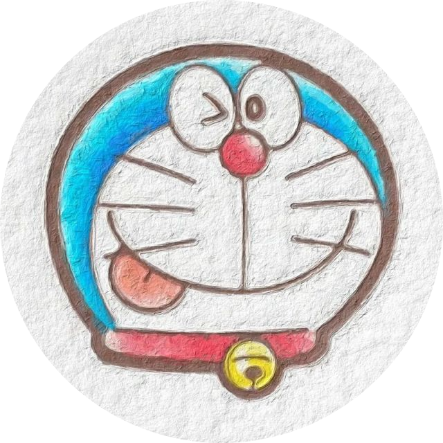

<!-- markdownlint-disable MD033 MD041 -->

    

# Doraemon

<!-- prettier-ignore-start -->
<!-- markdownlint-disable-next-line MD036 -->
_✨ 基于 NoneBot 实现的 QQ 机器人 ✨_
<!-- prettier-ignore-end -->

    
    
    
     
      
    

  <a href="#">文档</a>
  ·
  <a href="#">快速上手</a>

## 简介

Doraemon 是一个 基于 NoneBot2 实现的现代、跨平台、可扩展的 Python 聊天机器人

## ~~即刻开始~~

下次一定